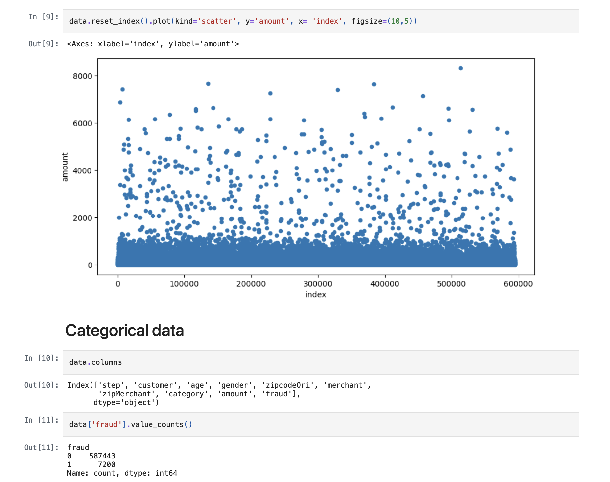
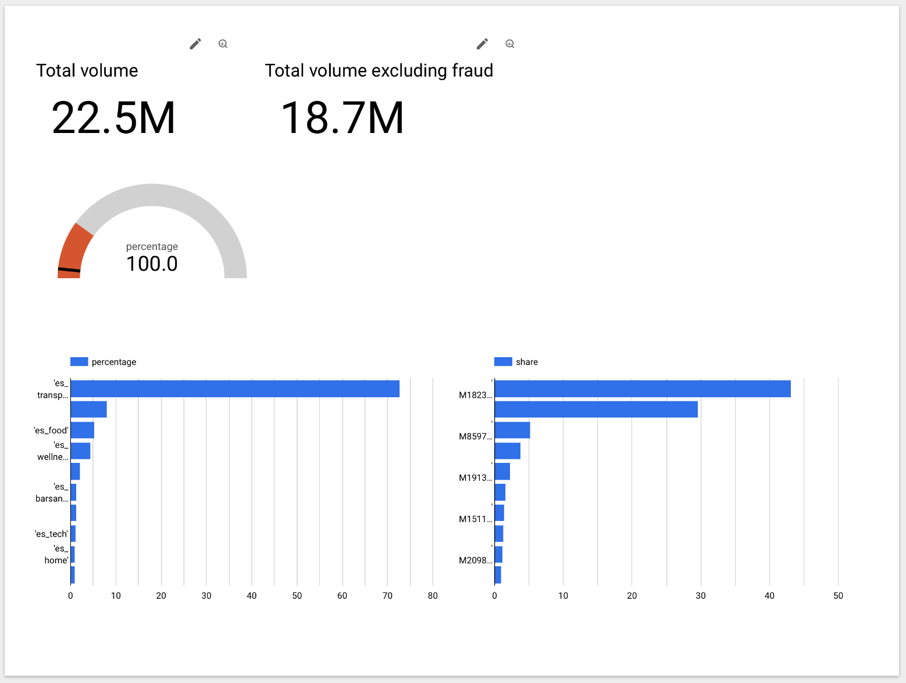

# Project attempt 1

## Disclaimer
This project was designed to be as simple as possible.  
I wanted to first test my understanding of how to create a pipeline using static, one-file data.  
In my second attempt, I aim to develop a more complex and interesting pipeline.

## Stack

On this project, I used:  
Docker,  
Jupyter Notebook (data exploration),  
Kestra (data workflow),  
dbt (data models),  
GCP (data lake, data warehouse, BI tool): Google Storage, BigQuery, and Looker.  
Python and SQL

## Step 1. Dataset and data exploration

Dataset was found on [Kaggle](https://www.kaggle.com/datasets/ealaxi/banksim1).  
The dataset contains payment data, including parameters such as merchant, transaction amount, fraud marker, and the client's age and gender.  

Data exploration step, made in the [notebook](https://github.com/polina-fuksman/data-engineering-zoomcamp/blob/main/project_1/payment_data_exploration.ipynb), showed that:  

- There are 594,643 rows in the dataset.  
- Data is clean and nice, no null values, no outliers, no duplicates in categorical data.  
- Datatypes are all correct.  

## Step 2. Data workflow with Kestra

Files [01_gcp_kv.yaml](https://github.com/polina-fuksman/data-engineering-zoomcamp/blob/main/project_1/01_gcp_kv.yaml) and [02_gcp_setup.yaml](https://github.com/polina-fuksman/data-engineering-zoomcamp/blob/main/project_1/02_gcp_setup.yaml) were created to establish the connection with GCP.  
[03_gcp_payments.yaml](https://github.com/polina-fuksman/data-engineering-zoomcamp/blob/main/project_1/03_gcp_payments.yaml) file represents the workflow itself, during which the unique_row_id was created and all data was transferred to the datalake and data warehouse.  

## Step 3. Data modeling with dbt

Data modeling step is represented in the [payments_models folder](https://github.com/polina-fuksman/data-engineering-zoomcamp/tree/main/project_1/payments_models)

stg_bs.sql - staging table  

payment_data.sql — the copy of the staging table without columns that wouldn't be needed for the visualization (unique_row_id, zipcodeOri and  zipMerchant columns were dropped)  
volume_by_category.sql, volume_by_fraud.sql and volume_by_merchant.sql — models to visualize data in Looker  

# Step 4. Visualization

The visualitation is answering the businees questions from the end user:

- What is the total amount?  
-  What is the total amount excluding fraudulent operations?  
-  What percentage of the total comes from fraudulent transactions, and how can we assess if it is close to the target of no more than 10%?  
-  What is the volume by merchants?  
-  What is the volume by category?

